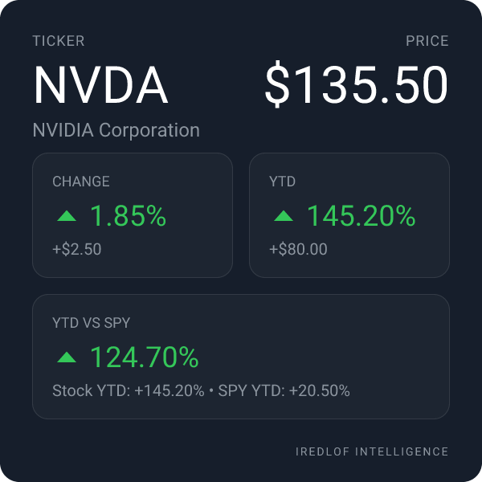
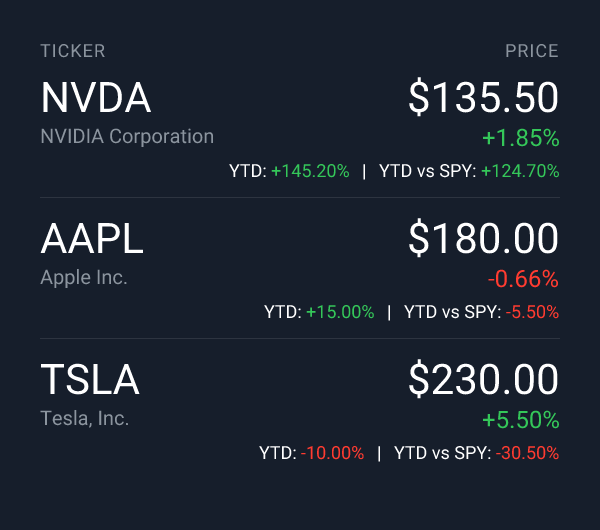
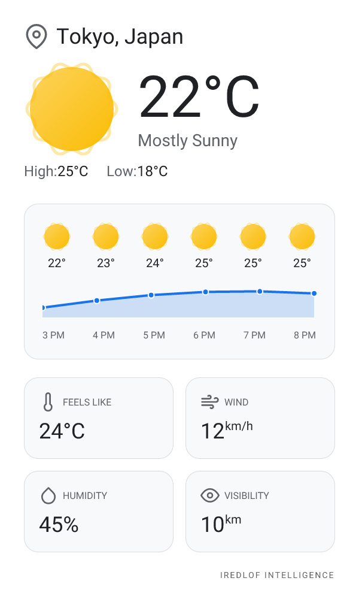
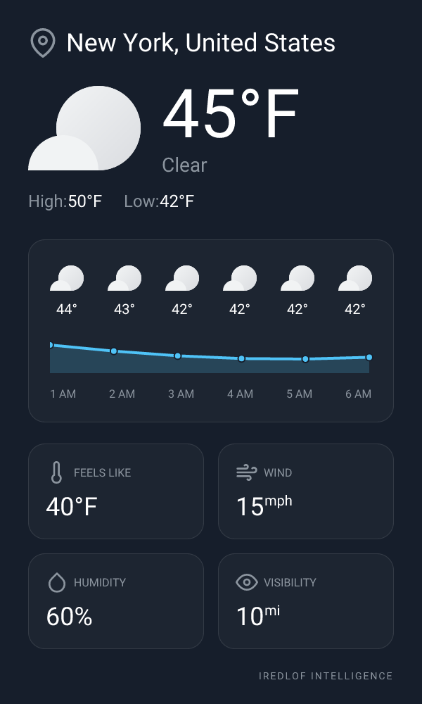

# 🤖 AI Telegram Bot - Stock & Weather Cards

A powerful Telegram bot that generates beautiful, visual cards for real-time stock quotes and weather information. Built with Firebase Cloud Functions, GrammY, and server-side image generation.


---

## 📸 Screenshots

### Single Stock Card
Query a single stock with `$AAPL` to get a detailed card:



**Features displayed:**
- Current price with daily change percentage
- Year-to-Date (YTD) performance
- YTD vs SPY comparison (S&P 500 benchmark)

### Multi-Stock Card
Query multiple stocks at once with `$AAPL $MSFT $GOOG`:



**Features displayed:**
- Up to 10 stocks in a single card
- Alphabetically sorted by ticker
- Compact view with price, change %, YTD, and YTD vs SPY

### 🌧️ Weather Cards
Get real-time weather with `Weather City`:

**Daytime vs Nighttime**
The card automatically adapts its theme and units based on location and time of day.

| Daytime (Tokyo - Metric) | Nighttime (New York - Imperial) |
|:---:|:---:|
|  |  |

**Features:**
- **Smart Theme**: Light mode for day, Dark mode for night
- **Auto-Units**: Imperial (F, mph) for US, Metric (C, km/h) for others
- **Hourly Forecast**: Next 6 hours trends
- **Detailed Metrics**: Feels like, Wind, Humidity, Visibility

---

## ✨ Features

### 📈 Stock Quotes
- **Real-time prices** via Yahoo Finance API
- **Single stock queries**: `$AAPL`, `$TSLA`, `$GOOG`
- **Multi-stock queries**: `$AAPL $MSFT $AMZN $NVDA` (up to 10 stocks)
- **Alphabetical sorting** for multi-stock cards
- **YTD Performance**: Calculated using the close price of the first trading day of the year
- **SPY Comparison**: Shows how the stock performs vs the S&P 500 benchmark
- **Color-coded values**: Green for gains, red for losses

### 🌤️ Weather
- **City-based queries**: `Weather London`, `Weather New York`
- **City-based queries**: `Weather London`, `Weather New York`
- **Smart Units**: Automatically uses Fahrenheit/Miles for US and Celsius/Kilometers for the rest of the world.
- **Dynamic Themes**: Changes between Light (Day) and Dark (Night) modes based on local time.
- **Detailed Forecast**: Hourly trend chart and key metrics.

### 🎨 Visual Cards
- **Server-side PNG generation** using Satori + Resvg
- **Dark theme** with professional styling
- **Custom Roboto font** rendering
- **Dynamic sizing** for multi-stock cards

---

## 🏗️ Architecture

```
AI-Telegram/
├── firebase.json          # Firebase configuration
├── functions/
│   ├── src/
│   │   ├── index.ts       # Firebase Functions entry point
│   │   ├── bot.ts         # GrammY bot handlers
│   │   ├── generator/
│   │   │   └── card.tsx   # React components for card generation
│   │   └── services/
│   │       ├── stock.ts   # Yahoo Finance integration
│   │       └── weather.ts # Weather API integration
│   ├── assets/
│   │   └── fonts/         # Roboto font files
│   ├── package.json
│   └── tsconfig.json
└── docs/
    └── screenshots/       # Documentation images
```

### Tech Stack
| Component | Technology |
|-----------|------------|
| Runtime | Node.js 20 |
| Cloud Functions | Firebase Functions (2nd Gen) |
| Bot Framework | GrammY |
| Stock Data | Yahoo Finance API (yahoo-finance2) |
| Image Generation | Satori (SVG) + Resvg (PNG) |
| Language | TypeScript |

---

## 🚀 Getting Started

### Prerequisites

- Node.js 20+
- Firebase CLI (`npm install -g firebase-tools`)
- A Telegram Bot Token (from [@BotFather](https://t.me/BotFather))

### Installation

1. **Clone the repository**
   ```bash
   git clone https://github.com/yourusername/AI-Telegram.git
   cd AI-Telegram
   ```

2. **Install dependencies**
   ```bash
   cd functions
   npm install
   ```

3. **Configure environment variables**
   
   Create `functions/.env`:
   ```env
   TELEGRAM_BOT_TOKEN=your_telegram_bot_token_here
   ```

4. **Build the project**
   ```bash
   npm run build
   ```

---

## 🧪 Local Development & Testing

### Start the Firebase Emulator

```bash
cd functions
npm run serve
```

This will:
- Build the TypeScript code
- Start the Firebase Functions emulator on `http://127.0.0.1:5001`
- Watch for file changes

### Set Up Webhook for Local Testing

You'll need to expose your local server to the internet. Use [ngrok](https://ngrok.com/) or a similar tunneling service:

```bash
# In a separate terminal
ngrok http 5001
```

Then set your Telegram webhook:
```bash
curl -X POST "https://api.telegram.org/bot<YOUR_TOKEN>/setWebhook" \
  -H "Content-Type: application/json" \
  -d '{"url": "https://your-ngrok-url.ngrok.io/demo-test/us-central1/telegramWebhook"}'
```

### Test Commands

Once the webhook is set, test in Telegram:

| Command | Description |
|---------|-------------|
| `/start` | Show welcome message and help |
| `$AAPL` | Get Apple stock card |
| `$AAPL $MSFT $GOOG` | Get multi-stock card |
| `Weather London` | Get weather card for London |
| `/start` | Activate bot interactions in current group (Admins only) |
| `/stop` | Deactivate bot interactions in current group (Admins only) |

---

## 📦 Deployment

### Deploy to Firebase

1. **Login to Firebase**
   ```bash
   firebase login
   ```

2. **Select your project**
   ```bash
   firebase use your-project-id
   ```

3. **Set environment secrets**
   ```bash
   firebase functions:secrets:set TELEGRAM_BOT_TOKEN
   ```

4. **Deploy**
   ```bash
   npm run deploy
   ```

### Configure Production Webhook

After deployment, set the webhook to your production URL:

```bash
curl -X POST "https://api.telegram.org/bot<YOUR_TOKEN>/setWebhook" \
  -H "Content-Type: application/json" \
  -d '{"url": "https://us-central1-your-project.cloudfunctions.net/telegramWebhook"}'
```

---

## 📊 YTD Calculation Methodology

The bot calculates Year-to-Date performance using the **correct Yahoo Finance methodology**:

```
YTD % = ((Current Price - Year Start Price) / Year Start Price) × 100
```

**Year Start Price** = Close price of the first trading day of the year (typically Jan 2nd)

This matches the official YTD values displayed on Yahoo Finance.

---

## 🛠️ Available Scripts

| Script | Description |
|--------|-------------|
| `npm run build` | Compile TypeScript to JavaScript |
| `npm run build:watch` | Watch mode for development |
| `npm run serve` | Build and start Firebase emulator |
| `npm run deploy` | Deploy to Firebase |
| `npm run logs` | View Firebase function logs |

---

## 🤝 Contributing

1. Fork the repository
2. Create your feature branch (`git checkout -b feature/amazing-feature`)
3. Commit your changes (`git commit -m 'feat: Add amazing feature'`)
4. Push to the branch (`git push origin feature/amazing-feature`)
5. Open a Pull Request

---

## 📄 License

This project is licensed under the ISC License.

---

## 🙏 Acknowledgments

- [GrammY](https://grammy.dev/) - Telegram Bot Framework
- [Satori](https://github.com/vercel/satori) - SVG generation from React
- [yahoo-finance2](https://github.com/gadicc/yahoo-finance2) - Yahoo Finance API wrapper
- [Firebase](https://firebase.google.com/) - Cloud Functions hosting

---

<p align="center">
  Made with ❤️ by iRedlof Team
</p>
